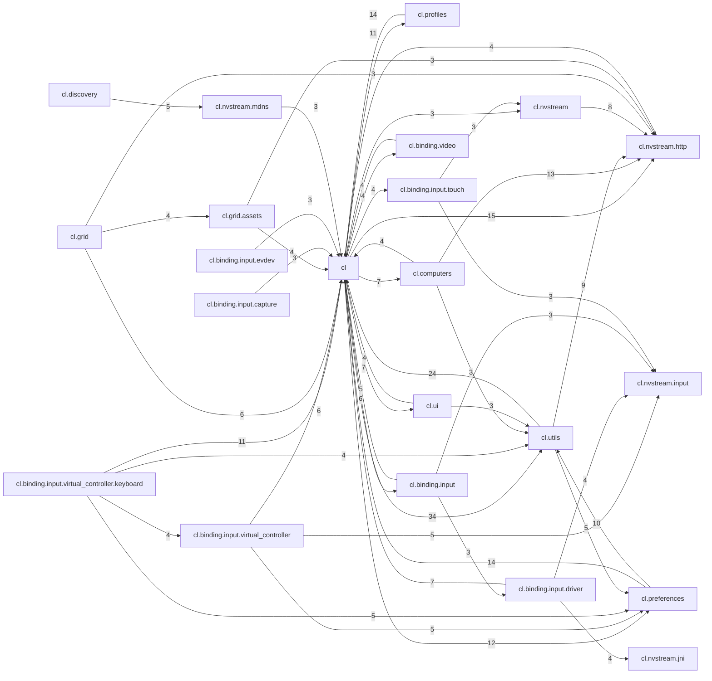

<!-- GERADO POR tools/codemap/codemap.mjs — NÃO EDITE À MÃO. Rode: node tools/codemap/codemap.mjs -->

# Grafo de Dependências

> Acoplamento entre pacotes, derivado dos imports `com.limelight.*`. Use para prever o raio de impacto de uma mudança.

## Pacotes por centralidade

| Pacote | PageRank | Arquivos | Linhas |
|---|--:|--:|--:|
| `com.limelight` | 231.6 | 20 | 9132 |
| `com.limelight.utils` | 104.8 | 22 | 5726 |
| `com.limelight.nvstream.http` | 104.4 | 6 | 1678 |
| `com.limelight.nvstream.jni` | 71.6 | 1 | 445 |
| `com.limelight.preferences` | 53.6 | 10 | 3052 |
| `com.limelight.nvstream` | 51.6 | 4 | 950 |
| `com.limelight.nvstream.av.audio` | 36.7 | 1 | 16 |
| `com.limelight.nvstream.av.video` | 31.7 | 1 | 22 |
| `com.limelight.profiles` | 26.1 | 8 | 1016 |
| `com.limelight.nvstream.input` | 25.8 | 3 | 51 |
| `com.limelight.computers` | 21.7 | 7 | 1598 |
| `com.limelight.ui` | 21.2 | 8 | 803 |
| `com.limelight.binding.input` | 19.6 | 5 | 4304 |
| `com.limelight.nvstream.mdns` | 15.1 | 5 | 733 |
| `com.limelight.binding.input.capture` | 14.9 | 6 | 403 |
| `com.limelight.binding.video` | 14.9 | 5 | 3735 |
| `com.limelight.binding` | 14.1 | 1 | 15 |
| `com.limelight.binding.input.virtual_controller.keyboard` | 13.7 | 12 | 4198 |
| `com.limelight.binding.input.evdev` | 13.7 | 6 | 627 |
| `com.limelight.binding.input.touch` | 13.4 | 4 | 1092 |
| `com.limelight.grid.assets` | 12.5 | 5 | 709 |
| `com.limelight.binding.audio` | 11.6 | 1 | 234 |
| `com.limelight.binding.crypto` | 11.6 | 1 | 260 |
| `com.limelight.binding.input.driver` | 11.4 | 8 | 1695 |
| `com.limelight.binding.input.virtual_controller` | 10.3 | 13 | 2815 |
| `com.limelight.grid` | 10.2 | 3 | 366 |
| `com.limelight.nvstream.wol` | 10.2 | 1 | 150 |
| `com.limelight.discovery` | 7.8 | 1 | 91 |
| `com.limelight.nvstream.av` | 7.0 | 1 | 58 |
| `com.limelight.shadows` | 7.0 | 3 | 72 |

## Mapa de dependências (Mermaid)

Arestas com peso >= 3 (número de imports distintos entre os pacotes).

## Comunidades detectadas

Agrupamento por label propagation — pacotes que mudam juntos com mais probabilidade.

**Comunidade 1** (28): `com.limelight`, `com.limelight.binding`, `com.limelight.binding.audio`, `com.limelight.binding.crypto`, `com.limelight.binding.input`, `com.limelight.binding.input.capture`, `com.limelight.binding.input.driver`, `com.limelight.binding.input.evdev`, `com.limelight.binding.input.touch`, `com.limelight.binding.input.virtual_controller`, `com.limelight.binding.input.virtual_controller.keyboard`, `com.limelight.binding.video`, `com.limelight.computers`, `com.limelight.discovery`, `com.limelight.grid`, `com.limelight.grid.assets`, `com.limelight.nvstream`, `com.limelight.nvstream.av.audio`, `com.limelight.nvstream.av.video`, `com.limelight.nvstream.http`, `com.limelight.nvstream.input`, `com.limelight.nvstream.jni`, `com.limelight.nvstream.mdns`, `com.limelight.nvstream.wol`, `com.limelight.preferences`, `com.limelight.profiles`, `com.limelight.ui`, `com.limelight.utils`

